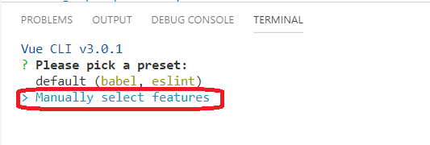
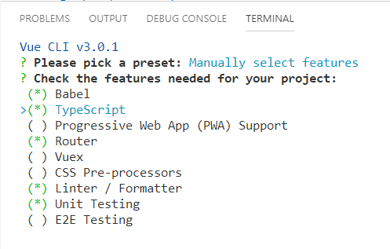

## Intro

In this sample we are goin got create a _hello world_ sample written in typescript and following the decorators approach.

## Steps

- If you are using Visual Studio Code let's install vetur extension (https://marketplace.visualstudio.com/items?itemName=octref.vetur)

- First let's install vue-cli globally (this will allow us create a boiler plate code).

```bash
npm install @vue/cli -g
```

- Now let's create the project:

  - Create a subfolder where the project will be located.
  - Under that folder form command prompt / bash laucn vue-cli, choose typescript as language.

```bash
vue create my-app
```
- Let's choose the following options

  - Step 0



  - Step 1



  - Step 2 (set of questions)
    - Use class-style component syntax? Yes
    - Use Babel alongside TypeScript for auto-detected polyfills? Yes
    - Use history mode for router? Yes
    - Pick a linter / formatter config: TSLint
    - Pick additional lint features: Lint on save
    - Pick a unit testing solution: Jest
    - Where do you prefer placing config for Babel, PostCSS, ESLint, etc.? In dedicated config files
    - Save this as a preset for future projects? No

- Now that we have the app, let's run it

```
npm run serve
```

- Time to remove boiler plate code, and keep something minimum.

- Let's remove the _HelloWorld.vue_ file, located in _./src/components/HelloWorld.vue_.

- Now let's remove the reference to this component in the _Home.vue_ page.

_./src/views/Home.vue_

```diff
<template>
  <div class="home">
+    <h3>Hello from home page</h3>    
-    
-    <HelloWorld msg="Welcome to Your Vue.js + TypeScript App"/>
  </div>
</template>

<script lang="ts">
import { Component, Vue } from 'vue-property-decorator';
- import HelloWorld from '@/components/HelloWorld.vue'; // @ is an alias to /src

- @Component({
-   components: {
-     HelloWorld,
-   },
- })
export default class Home extends Vue {}
</script>
```

- The vue tooling (vue-cli) is quite powerful in this sample we have already setup:
  - Basic Typescript scaffolding.
  - Routing.

Explore the project and check the features added.

# How to run the project

## Project setup
```
npm install
```

### Compiles and hot-reloads for development
```
npm run serve
```

### Compiles and minifies for production
```
npm run build
```

### Lints and fixes files
```
npm run lint
```

### Run your unit tests
```
npm run test:unit
```
